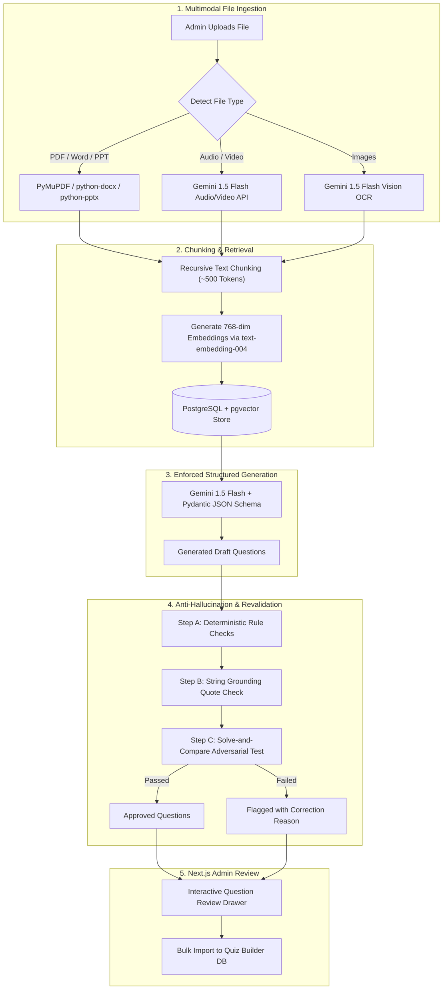

# Multimodal RAG System Architecture & Design Specification
## Quiz Management System

This document outlines the complete architectural design, data pipelines, validation strategies, and implementation details for integrating a **Multimodal RAG (Retrieval-Augmented Generation) & Automated Quiz Generation System** into the Quiz Platform.

---

## 🎯 1. System Objectives

1. **Multimodal Content Ingestion**: Allow Admins and Instructors to upload raw source materials in any format:
   - **Documents**: PDF (`.pdf`), Word (`.docx`), PowerPoint (`.pptx`), Plain Text (`.txt`).
   - **Audio / Video**: Audio recordings (`.mp3`, `.wav`), Lectures (`.mp4`, `.mov`).
   - **Images**: Diagram snapshots, infographics (`.png`, `.jpg`).
2. **Automated Quiz Generation**: Convert uploaded source materials into high-quality Multiple-Choice Questions (MCQs) complete with:
   - Question text
   - 4 options with exact 1 correct answer
   - Detailed educational explanations
3. **Anti-Hallucination & Revalidation Engine**: Guarantee 99%+ factual accuracy using automated multi-pass verification (Solve-and-Compare, Grounding Quotes, and Deterministic Rules).
4. **Seamless Admin UX**: Provide an interactive review & edit drawer in Next.js for bulk-importing questions into the Quiz Builder.

---

## 🏗️ 2. System Architecture Overview



---

## 📂 3. Multimodal Extraction Strategy

| Source Format | Processor Engine | Extraction Method |
| :--- | :--- | :--- |
| **PDF (`.pdf`)** | `PyMuPDF` (`fitz`) / `pypdf` | Extracts structured text paragraphs and tables. |
| **Word (`.docx`)** | `python-docx` | Extracts headings, paragraphs, and list items. |
| **PowerPoint (`.pptx`)** | `python-pptx` | Extracts text from slides, text frames, and speaker notes. |
| **Audio (`.mp3`, `.wav`)** | Gemini 1.5 Flash File API / Whisper | Transcribes audio to timestamped text transcript. |
| **Video (`.mp4`, `.mov`)** | Gemini 1.5 Native Video API | Extract audio track & visual keyframes for transcription. |
| **Images (`.png`, `.jpg`)** | Gemini 1.5 Vision API | OCR text extraction + diagram concept description. |

---

## 🛡️ 4. Anti-Hallucination & Revalidation Engine

To ensure the AI never generates biased, ambiguous, or false questions, the system implements a **3-Layer Revalidation Pipeline**:

### Layer 1: Programmatic Rule Checks (Zero Cost, Instant)
- **Exactly 1 Correct Option**: Rejects questions with 0 or multiple correct flags.
- **No Duplicate Options**: Rejects questions where option texts overlap.
- **Forbidden Phrases**: Flags lazy options like *"All of the above"* or *"None of the above"*.

### Layer 2: Literal Quote Grounding Verification
Every generated question **MUST** return a `source_quote` attribute containing the exact sentence from the source text.
```python
if question.source_quote.strip() not in raw_source_text:
    question.status = "FLAGGED"
    question.flag_reason = "Source quote not found word-for-word in document (Potential Hallucination)."
```

### Layer 3: Adversarial "Solve & Compare" Pattern
To avoid self-correction bias (where an LLM stubbornly defends its own mistake):
1. Take the generated question and its 4 options.
2. **Hide the Answer Key**.
3. Pass the question to a **fresh, independent LLM prompt** acting as a test-taker.
4. If the test-taker picks a **different option** than the answer key, mark the question as `FLAGGED_AMBIGUOUS`.

---

## 🗄️ 5. Database Schema Additions

### 1. Vector Storage Table (`backend/models/rag.py`)
```python
from sqlalchemy import Column, Integer, String, Text, ForeignKey, DateTime
from sqlalchemy.sql import func
from pgvector.sqlalchemy import Vector
from config.database import Base

class DocumentChunk(Base):
    __tablename__ = "document_chunks"

    id = Column(Integer, primary_key=True, index=True)
    quiz_id = Column(Integer, ForeignKey("quizzes.id"), nullable=True)
    file_name = Column(String(255), nullable=False)
    file_type = Column(String(50), nullable=False)
    content = Column(Text, nullable=False)
    embedding = Column(Vector(768), nullable=False)  # Gemini text-embedding-004 (768 dimensions)
    created_at = Column(DateTime(timezone=True), server_default=func.now())
```

### 2. Pydantic Generation Schema (`backend/schemas/ai_generator.py`)
```python
from pydantic import BaseModel, Field
from typing import List, Optional

class AIGeneratedOption(BaseModel):
    text: str = Field(description="Text of the option")
    is_correct: bool = Field(description="True if this is the correct option")
    order: int = Field(description="Display order (1 to 4)")

class AIGeneratedQuestion(BaseModel):
    text: str = Field(description="The question text")
    type: str = Field(default="mcq", description="mcq or true_false")
    marks: int = Field(default=1, description="Marks assigned")
    explanation: str = Field(description="Detailed explanation for the correct answer")
    source_quote: str = Field(description="Exact sentence copy-pasted from source document")
    options: List[AIGeneratedOption]
    validation_status: Optional[str] = Field(default="PASSED", description="PASSED or FLAGGED")
    flag_reason: Optional[str] = None

class AIQuizGenerationResponse(BaseModel):
    quiz_title_suggestion: str
    quiz_description_suggestion: str
    questions: List[AIGeneratedQuestion]
```

---

## 🔌 6. API Endpoints Specification

### `POST /api/admin/ai/generate`
- **Consumes**: `multipart/form-data`
- **Parameters**:
  - `file`: `UploadFile` (PDF, DOCX, PPTX, MP3, MP4, PNG)
  - `num_questions`: `int` (default: 5)
  - `difficulty`: `str` (`easy`, `medium`, `hard`)
  - `instructions`: `str | None` (custom focus instructions)
- **Returns**: `AIQuizGenerationResponse` JSON.

### `POST /api/admin/ai/revalidate-question`
- **Consumes**: Single question payload.
- **Action**: Runs the **Solve & Compare** adversarial test.
- **Returns**: `{ "is_valid": true/false, "suggested_correct_option_index": int, "explanation": str }`.

---

## 💻 7. Frontend Next.js Review UX Component Design

The Admin UI should follow a **3-State Modal Pattern**:

1. **State A: Upload & Configuration Form**:
   - File dropzone supporting all document/media formats.
   - Sliders for question count (5 to 20) and difficulty badges.
   - Textarea for custom instructions (e.g. *"Emphasize Chapter 4 topics"*).

2. **State B: Generation & Verification Loader**:
   - Animated progress bar showing status:
     - `Processing file content...`
     - `Generating questions...`
     - `Running anti-hallucination verification...`

3. **State C: Interactive Question Review Table**:
   - Displays all generated questions with color-coded status badges:
     - 🟢 **Passed**: Grounding quote verified & solver agreed.
     - 🟡 **Flagged**: Solved differently or quote missing (highlighted with edit suggestion).
   - Admin can edit text, options, or delete questions.
   - Single-click **"Import Questions"** button that sends the final array directly to `bulkUploadQuestionsRequest`.

---

## 🗺️ 8. Implementation Roadmap

- [ ] **Phase 1: Environment Setup**
  - Enable `pgvector` extension in PostgreSQL container.
  - Install dependencies (`google-genai`, `pgvector`, `pypdf`, `python-docx`, `python-pptx`).
- [ ] **Phase 2: Backend Development**
  - Create `DocumentChunk` model & migration.
  - Implement `/admin/ai/generate` endpoint with Gemini 1.5 Structured Output.
  - Implement Solve & Compare verification function.
- [ ] **Phase 3: Frontend Development**
  - Build `AIQuizGeneratorModal` component in `@/modules/admin/components/`.
  - Wire up file upload, generation loading state, and interactive review drawer.
- [ ] **Phase 4: Testing & Calibration**
  - Test with sample PDF, Word doc, MP3 audio, and MP4 video files.
  - Verify hallucination detection rates on tricky edge cases.
